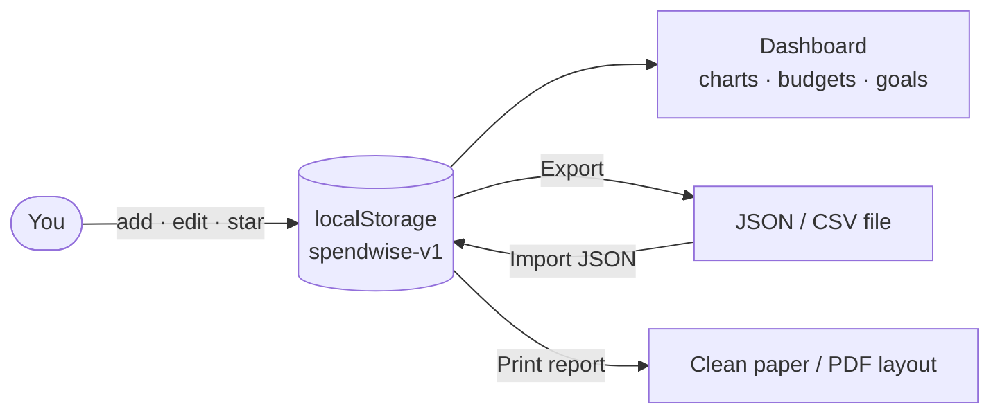

<div align="center">




<br>


<br>

[**Features**](#features) &nbsp;•&nbsp; [**Theme Lab**](#theme-lab) &nbsp;•&nbsp; [**Control Room**](#control-room) &nbsp;•&nbsp; [**Shortcuts**](#shortcuts) &nbsp;•&nbsp; [**Your Data**](#your-data) &nbsp;•&nbsp; [**Quick Start**](#quick-start) &nbsp;•&nbsp; [**Under the Hood**](#under-the-hood)


</div>

## The pitch

**SpendWise** (*خرج‌یار*) is a personal finance dashboard that lives in **one HTML file**. No account, no server, no build step, no framework. Open it, log a transaction, and watch your month come to life with animated charts, budget alerts, savings goals and a settings panel with more knobs than a recording studio.

<table>
  <tr>
    <td align="center" width="33%"><h3>🔒 Private</h3>Everything is stored in your browser. Nothing is uploaded, ever.</td>
    <td align="center" width="33%"><h3>⚡ Instant</h3>One file. Double-click and you are tracking expenses in a second.</td>
    <td align="center" width="33%"><h3>🎨 Yours</h3>5 themes, 6 backdrops, custom accent color, reorderable sections.</td>
  </tr>
</table>

<br>

<div align="center">
  
  <br>
  <sub>Illustrative preview. Open the app to see the real thing.</sub>
</div>

<br>


<a name="features"></a>

## Feature constellation

Six orbits, one app.

| Orbit | What is inside |
| :-- | :-- |
| 💸 **Ledger** | Income and expenses with amount, category, date, note and tag. Star favorites, edit anything, delete with a one-tap **Undo**. Persian digits and thousands separators are accepted as input. |
| 📊 **Insights** | Period balance, income, expenses and savings rate at a glance. Smart insights: **average daily spend**, **top category**, **projected month-end spend** and **largest expense**. |
| 🍩 **Charts** | Animated category-share donut, a **6-month trend** chart, and per-category bars. |
| 🎯 **Budgets & Goals** | Monthly cap per category with a configurable warning threshold (50–100%). Bars turn amber when you are close and red when you go over, with a toast to match. Savings goals take deposits and track progress. |
| 🔎 **Search & Filter** | Live search across notes, tags and categories. Filter by type or category. Sort by newest, oldest or largest. |
| 🌐 **Locale** | Persian (RTL) and English. Toman, Rial, USD or EUR. Jalali or Gregorian calendar. Latin or Arabic digits. |

<details>
<summary><b>The 14 built-in categories</b></summary>

<br>

| Expenses | Income | Both |
| :-- | :-- | :-- |
| Food · Housing · Transport · Shopping · Health · Fun · Education · Bills · Travel | Salary · Freelance · Investments | Gifts · Other |

</details>


<a name="theme-lab"></a>

## Theme lab

Make it look like *your* money app.

**Themes:** `Light` · `Dark` · `Auto` · `Sepia` · `Midnight`

**One-tap style presets** (each one sets theme, accent, backdrop and card style together):


| Dial | Options |
| :-- | :-- |
| 🎨 **Accent color** | Full HSL control with three sliders |
| 🪟 **Card style** | Glass · Solid · Outline |
| 🌌 **Backdrop** | Plain · Dots · Grid · Lines · **Aurora** · **Stars** (with an intensity slider) |
| 🔤 **Fonts** | Vazirmatn · Noto Kufi Arabic · Noto Naskh Arabic · System UI |
| 📐 **Shape & size** | Corner radius 0–30px, text size 85–130% |


<a name="control-room"></a>

## Control room

Press <kbd>,</kbd> (comma) to open the settings panel. It has its own search box, a built-in guide, and six tabs:

| Tab | Controls |
| :-- | :-- |
| 🎨 **Look** | Theme, accent, presets, card style, corners, text size, font |
| 🌌 **Backdrop** | Background pattern and intensity |
| 🎛️ **Interface** | Animation switches (below) and language |
| 🌍 **Units** | Currency, digit style, calendar, default view (monthly or all-time) |
| 🧩 **Content** | Show, hide and **reorder** dashboard sections, set the budget-warning threshold |
| 💾 **Data** | Export, import, print, sample data, clear, reset |

**Interface switches:**

| Switch | Effect |
| :-- | :-- |
| ✨ Animations | Master switch for all motion |
| 📜 Reveal on scroll | Cards slide in as they enter the viewport |
| 📏 Scroll progress bar | Thin gradient bar across the top |
| 🧊 3D cards | Cards tilt toward your cursor |
| 🔦 Cursor glow | A soft spotlight follows your mouse |
| 🔢 Animated counting | Numbers count up to their new value |
| 📦 Compact mode | Tighter spacing for dense screens |
| 👁️ High contrast | Stronger text and borders |

> [!NOTE]
> SpendWise also honors `prefers-reduced-motion`, so people who ask their OS for less motion get none.


<a name="shortcuts"></a>

## Shortcuts

| Key | Action |
| :-: | :-- |
| <kbd>N</kbd> | New transaction |
| <kbd>/</kbd> | Jump to search |
| <kbd>,</kbd> | Toggle settings |
| <kbd>Esc</kbd> | Close any dialog or panel |
| <kbd>Enter</kbd> | Save, when the transaction form is open |


<a name="your-data"></a>

## Your data

Your numbers stay on your device, in your browser's `localStorage`, under the key `spendwise-v1`.



| Action | Format | Notes |
| :-- | :-- | :-- |
| **Export** | JSON | Transactions, budgets, goals **and** settings in one file |
| **Export** | CSV | Opens in Excel or Sheets (UTF-8 with BOM, so Persian text survives) |
| **Import** | JSON | Pick a file or paste text. Invalid rows are skipped |
| **Print** | Browser print | A dedicated print stylesheet hides the chrome and keeps cards intact |
| **Sample data** | Built in | Adds about 110 realistic transactions so you can explore |

<details>
<summary><b>Export file shape</b></summary>

```jsonc
{
  "v": 1,
  "tx": [
    {
      "id": "k3f9a1",
      "t": "e",              // "e" = expense, "i" = income
      "a": 250000,           // amount, in the base unit
      "c": "food",           // category key
      "d": "2026-10-05",     // ISO date
      "n": "Groceries",      // note
      "g": "weekly",         // tag
      "f": 0                 // 1 = starred
    }
  ],
  "bud": { "food": 900000 },
  "goals": [{ "id": "g1", "n": "Summer trip", "t": 30000000, "s": 9000000 }],
  "settings": { "theme": "auto", "lang": "en" }
}
```

CSV columns: `date, type, category, amount, note, tag`

</details>

> [!IMPORTANT]
> `localStorage` belongs to one browser on one device. Clearing site data or switching browsers means starting fresh, so **export a JSON backup now and then**.


<a name="quick-start"></a>

## Quick start

```bash
git clone https://github.com/YOUR_USERNAME/spendwise.git
cd spendwise
open index.html        # macOS · or just double-click the file
```

That is the whole setup: **no `npm install`, no build step.**

Prefer a local server?

```bash
python3 -m http.server 8080   # then visit http://localhost:8080
```

### Put it online with GitHub Pages

1. Make sure the app file is named **`index.html`** in the repo root.
2. Go to **Settings → Pages**.
3. Choose **Deploy from a branch**, pick `main` and `/ (root)`, then save.
4. Your app goes live at `https://YOUR_USERNAME.github.io/spendwise/`.


<a name="under-the-hood"></a>

## Under the hood

<details open>
<summary><b>What makes it tick</b></summary>

<br>

| Piece | How it is done |
| :-- | :-- |
| **Zero dependencies** | Vanilla HTML, CSS and JavaScript in a single file |
| **Theming** | CSS custom properties switched through `data-*` attributes on `<html>` |
| **Icons** | An inline SVG sprite (`<symbol>` + `<use>`), no icon font, no requests |
| **Charts** | Hand-drawn SVG with CSS keyframe animations (stroke-dash donut, scale-in bars) |
| **i18n** | Two in-file dictionaries (`fa`, `en`) with a `T(key)` lookup and instant switching |
| **RTL** | Logical CSS properties (`inset-inline-*`, `margin-inline-*`) so layouts mirror correctly |
| **Scroll reveal** | `IntersectionObserver` |
| **Persistence** | `localStorage` with defensive `try/catch`, plus normalised imports |
| **Accessibility** | Visible focus rings, `role="switch"` toggles, ARIA labels, reduced-motion support, high-contrast mode |

</details>

<details>
<summary><b>Project layout</b></summary>

```text
spendwise/
├── index.html        # the entire app
├── README.md
└── assets/
    ├── banner.svg    # animated header
    ├── typing.svg    # rotating taglines
    ├── divider.svg   # animated section divider
    └── preview.svg   # animated dashboard illustration
```

</details>

<details>
<summary><b>A note on the network</b></summary>

<br>

The only external request SpendWise makes is the **Google Fonts** stylesheet for Vazirmatn and the Noto families. Without a connection the app still works and falls back to your system font. For a fully offline setup, self-host the font files and point the `<link>` at them.

</details>


## Roadmap ideas

- [x] Income, expenses, budgets and savings goals
- [x] Persian and English, RTL, Jalali calendar
- [x] JSON and CSV export, JSON import, print layout
- [ ] Recurring transactions
- [ ] Installable PWA with offline caching
- [ ] Self-hosted fonts
- [ ] CSV import
- [ ] Multi-currency with exchange rates

## Contributing

Ideas and pull requests are welcome. Open an issue first for anything big. Because the whole app is one file, a change is easy to review: open the HTML, edit, refresh.

## License

Released under the [MIT License](LICENSE).

<details>
<summary>🇮🇷 &nbsp;خلاصه به فارسی</summary>

<div dir="rtl">

<br>

**خرج‌یار** یک مدیریت درآمد و هزینهٔ شخصی است که در **یک فایل HTML** اجرا می‌شود؛ بدون حساب کاربری، بدون سرور و بدون نصب. تراکنش ثبت کنید، بودجهٔ دسته‌ها را تعیین کنید، هدف پس‌انداز بسازید و نمودارها و تحلیل ماهانه را ببینید. تقویم شمسی، واحد تومان و ریال، رابط راست‌به‌چپ و ظاهر کاملاً قابل شخصی‌سازی دارد. داده‌ها فقط روی دستگاه خودتان ذخیره می‌شوند.

</div>

</details>

<br>

<div align="center">
  
  <sub>Built with care for people who like their money tidy. If SpendWise helped you, a ⭐ on the repo is much appreciated.</sub>
</div>
